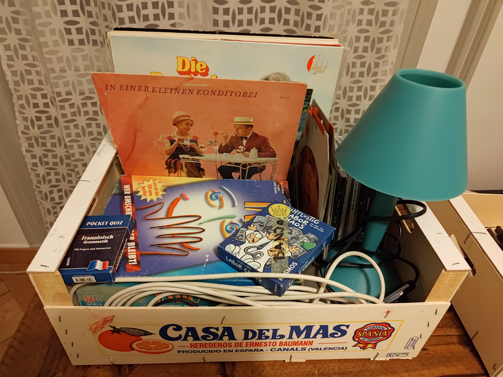
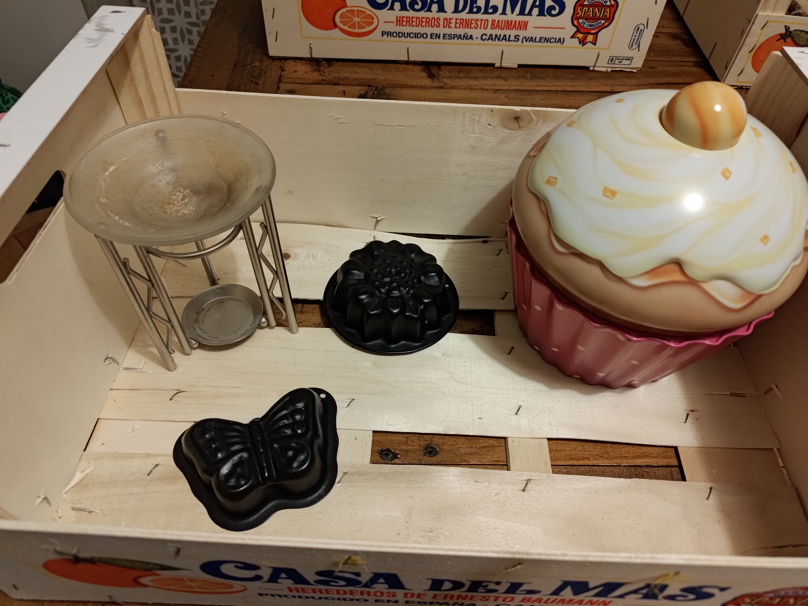
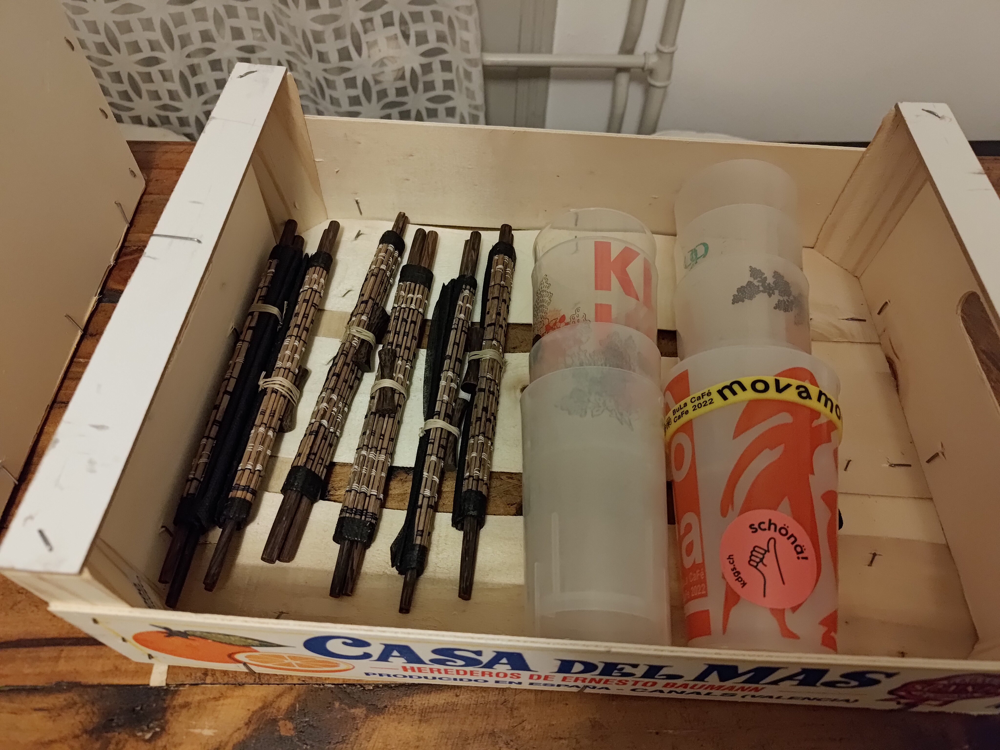
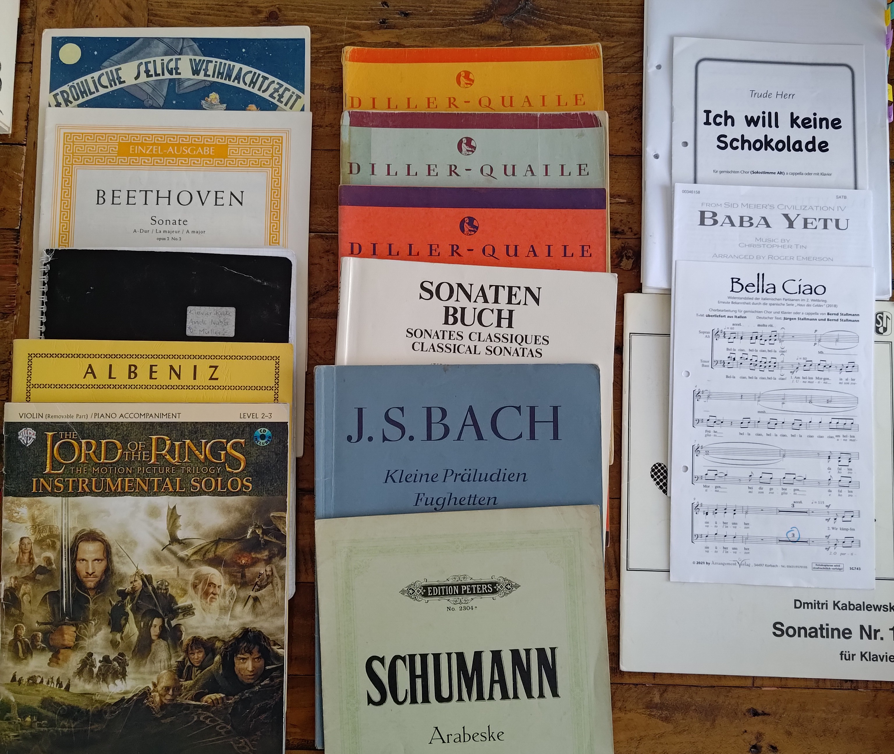

# Nubers Flohmarkt

Wir ziehen um. Ab Mitte April findet man uns ännet dä Ganggelibrugg. Vorher ist Entrümpeln angesagt. 

Was auf dem Tisch liegt, kann gratis abgeholt werden. Komm vorbei, nimm, was du willst. Bis zum Umzug werden immer wieder neue Dinge auf dem Tisch liegen. Die Fotos werden regelmässig aktualisiert.

## Spielregeln

- keine Reservationen
- keine Lieferung
- s'hät, was gad hät

## was gad hät

